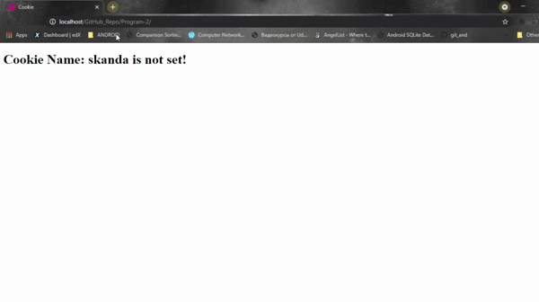

# Program 2

A program to store last visit time of a user in a cookie and display it on next visit.

**Using $_COOKIE variable**

```php
<?php 
    setcookie(cookie_name, cookie_value, time_to_live); # used to set a new cookie
	$_COOKIE['cookie_name']; # gets the value of the cookie
?>
```

### How to execute?

1. Fork on download in a zip file and extract in your local machine.
2. Copy this folder into C:/wamp64/www/
3. Start apache server using WAMP or XAMPP.
4. Open browser of your choice and enter **localhost/Program-2**

### Screenshot

------



##### Date: 15/5/2021

