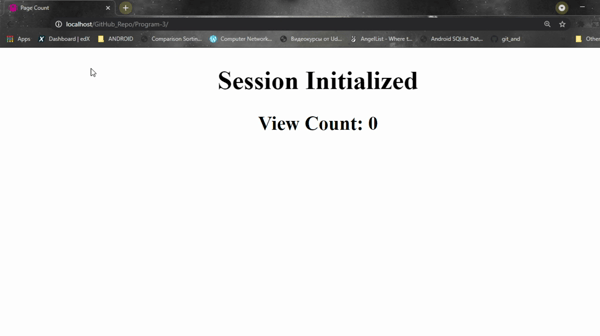

# Program 3

Program to store page views in session.

**Using $_SESSION variable**

```php
<?php 
    session_start(); // used to start the current session
	$_SESSION['variable']=0 // initializing the session variables
?>
```

### How to execute?

1. Fork on download in a zip file and extract in your local machine.
2. Copy this folder into C:/wamp64/www/
3. Start apache server using WAMP or XAMPP.
4. Open browser of your choice and enter **localhost/Program-3**

### Screenshot

------



##### Date: 15/5/2021

